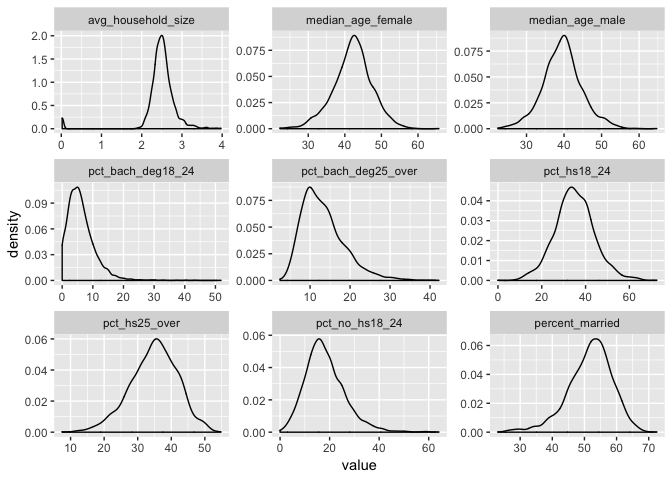

final\_project
================
Kangkang Zhang
12/7/2018

``` r
library(tidyverse)
```

    ## ── Attaching packages ────────────────────────────────────────────────────────────── tidyverse 1.2.1 ──

    ## ✔ ggplot2 3.0.0     ✔ purrr   0.2.5
    ## ✔ tibble  1.4.2     ✔ dplyr   0.7.8
    ## ✔ tidyr   0.8.1     ✔ stringr 1.3.1
    ## ✔ readr   1.1.1     ✔ forcats 0.3.0

    ## ── Conflicts ───────────────────────────────────────────────────────────────── tidyverse_conflicts() ──
    ## ✖ dplyr::filter() masks stats::filter()
    ## ✖ dplyr::lag()    masks stats::lag()

``` r
cancer_data = read_csv("./data/Cancer_Registry.csv")
```

    ## Parsed with column specification:
    ## cols(
    ##   .default = col_double(),
    ##   avgDeathsPerYear = col_integer(),
    ##   medIncome = col_integer(),
    ##   popEst2015 = col_integer(),
    ##   binnedInc = col_character(),
    ##   Geography = col_character()
    ## )

    ## See spec(...) for full column specifications.

``` r
#check missing data
cancer_data %>% 
  summarise_all(funs(sum(is.na(.)))) %>% 
  gather(term, na_num, avgAnnCount:BirthRate) %>% 
  filter(na_num > 0) %>% 
  mutate(percent = na_num/sum(na_num))
```

    ## # A tibble: 3 x 3
    ##   term                    na_num percent
    ##   <chr>                    <int>   <dbl>
    ## 1 PctSomeCol18_24           2285  0.750 
    ## 2 PctEmployed16_Over         152  0.0499
    ## 3 PctPrivateCoverageAlone    609  0.200

``` r
cancer_data = cancer_data %>% 
  janitor::clean_names() %>% 
  select(target_death_rate, everything())
```

extract names of numeric variable

``` r
vars = names(cancer_data)[-9] %>% 
          .[-12]


#keep(is.numeric) 
```

summary statistics for each numeric variable

``` r
cancer_data %>%
  select(vars) %>% 
  summary() %>% 
  broom::tidy() %>%
  select(- Var1) %>% 
  separate(n, c("stat", "value"), sep = ":") %>% 
  spread(key = Var2, value = value)
```

    ## # A tibble: 8 x 33
    ##   stat  `  birth_rate` `  med_income` `  median_age` `  pct_asian`
    ##   <chr> <chr>          <chr>          <chr>          <chr>        
    ## 1 1st … " 4.521  "     " 38882  "     " 37.70  "     " 0.2542  "  
    ## 2 3rd … " 6.494  "     " 52492  "     " 44.00  "     " 1.2210  "  
    ## 3 "Max… "21.326  "     "125635  "     "624.00  "     "42.6194  "  
    ## 4 "Mea… " 5.640  "     " 47063  "     " 45.27  "     " 1.2540  "  
    ## 5 "Med… " 5.381  "     " 45207  "     " 41.00  "     " 0.5498  "  
    ## 6 "Min… " 0.000  "     " 22640  "     " 22.30  "     " 0.0000  "  
    ## 7 "NA'… <NA>           <NA>           <NA>           <NA>         
    ## 8 <NA>  <NA>           <NA>           <NA>           <NA>         
    ## # ... with 28 more variables: ` pct_black` <chr>, ` pct_white` <chr>, `
    ## #   pct_hs18_24` <chr>, ` pop_est2015` <chr>, avg_ann_count <chr>,
    ## #   avg_deaths_per_year <chr>, avg_household_size <chr>,
    ## #   incidence_rate <chr>, median_age_female <chr>, median_age_male <chr>,
    ## #   pct_bach_deg18_24 <chr>, pct_bach_deg25_over <chr>,
    ## #   pct_emp_priv_coverage <chr>, pct_employed16_over <chr>,
    ## #   pct_hs25_over <chr>, pct_married_households <chr>,
    ## #   pct_no_hs18_24 <chr>, pct_other_race <chr>,
    ## #   pct_private_coverage <chr>, pct_private_coverage_alone <chr>,
    ## #   pct_public_coverage <chr>, pct_public_coverage_alone <chr>,
    ## #   pct_some_col18_24 <chr>, pct_unemployed16_over <chr>,
    ## #   percent_married <chr>, poverty_percent <chr>, study_per_cap <chr>,
    ## #   target_death_rate <chr>

check normality of each variable

``` r
#variable 1:9
cancer_data %>%
  select(vars[1:9]) %>% 
  gather() %>%   
  ggplot(aes(value)) +                    
    facet_wrap(~ key, scales = "free") +  
    geom_density(na.rm = TRUE) 
```


``` r
#variable 10:18
cancer_data %>%
  select(vars[10:18]) %>% 
  gather() %>%   
  ggplot(aes(value)) +                    
    facet_wrap(~ key, scales = "free") +  
    geom_density(na.rm = TRUE) 
```



``` r
#variable 19:27
cancer_data %>%
  select(vars[19:27]) %>% 
  gather() %>%   
  ggplot(aes(value)) +                    
    facet_wrap(~ key, scales = "free") +  
    geom_density(na.rm = TRUE) 
```


``` r
#variable 28:32
cancer_data %>%
  select(vars[28:32]) %>% 
  gather() %>%   
  ggplot(aes(value)) +                    
    facet_wrap(~ key, scales = "free") +  
    geom_density(na.rm = TRUE) 
```


check linear relationship

``` r
#variable 2:10
cancer_data %>%
  select(vars[1:10]) %>% 
  gather(key = key, value, vars[2:10]) %>%   
  ggplot(aes(x = value, y = target_death_rate)) +                    
    facet_wrap(~ key, scales = "free") +  
    geom_point(na.rm = TRUE) 
```


``` r
#variable 11:19
cancer_data %>%
  select(target_death_rate, vars[11:19]) %>% 
  gather(key = key, value, vars[11:19]) %>%   
  ggplot(aes(x = value, y = target_death_rate)) +                    
    facet_wrap(~ key, scales = "free") +  
    geom_point(na.rm = TRUE) 
```


``` r
#variable 20:28
cancer_data %>%
  select(target_death_rate, vars[20:28]) %>% 
  gather(key = key, value, vars[20:28]) %>%   
  ggplot(aes(x = value, y = target_death_rate)) +                    
    facet_wrap(~ key, scales = "free") +  
    geom_point(na.rm = TRUE) 
```


``` r
#variable 29:32
cancer_data %>%
  select(target_death_rate, vars[29:32]) %>% 
  gather(key = key, value, vars[29:32]) %>%   
  ggplot(aes(x = value, y = target_death_rate)) +                    
    facet_wrap(~ key, scales = "free") +  
    geom_point(na.rm = TRUE) 
```


