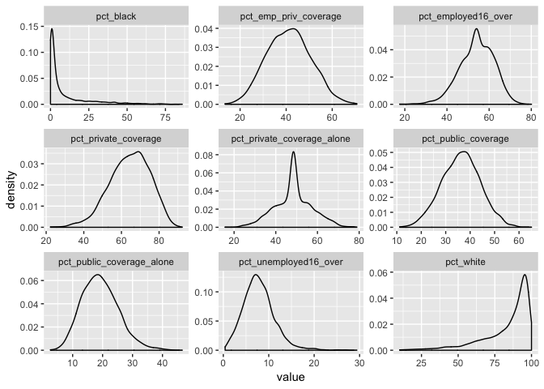
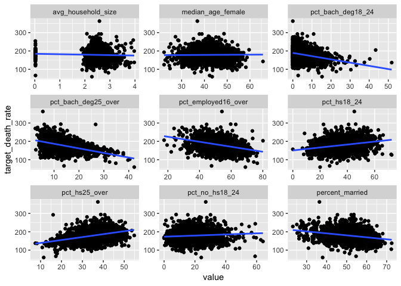

final\_project
================
Kangkang Zhang
12/7/2018

``` r
library(tidyverse)
```

Import data and check missing values.

``` r
cancer_data_raw = read_csv("./data/Cancer_Registry.csv")

#check missing data
cancer_data_raw %>%
    janitor::clean_names() %>% 
  summarise_all(funs(sum(is.na(.)))) %>% 
  gather(term, na_num, avg_ann_count:birth_rate) %>% 
  filter(na_num > 0) %>% 
  mutate(percent = na_num/sum(na_num))
```

    ## # A tibble: 3 x 3
    ##   term                       na_num percent
    ##   <chr>                       <int>   <dbl>
    ## 1 pct_some_col18_24            2285  0.750 
    ## 2 pct_employed16_over           152  0.0499
    ## 3 pct_private_coverage_alone    609  0.200

Exclude variable PctSomeCol18\_24 since its missing rate is 75%. Fill in missing values in pct\_employed16\_over and pct\_private\_coverage\_alone using mean values of all none-NA obs.

``` r
cancer_data = cancer_data_raw %>% 
  janitor::clean_names() %>%
  select(target_death_rate, everything(), - pct_some_col18_24) %>%
  mutate(pct_employed16_over = ifelse(is.na(pct_employed16_over), 
                                      mean(pct_employed16_over, na.rm = TRUE), pct_employed16_over),
         pct_private_coverage_alone = ifelse(is.na(pct_private_coverage_alone), 
                                      mean(pct_private_coverage_alone, na.rm = TRUE), pct_private_coverage_alone))
```

extract names of numeric variable

``` r
vars = cancer_data %>% 
  keep(is.numeric) %>% 
  names()
```

summary statistics for each numeric variable

``` r
cancer_data %>%
  select(vars) %>% 
  summary() %>% 
  broom::tidy() %>%
  select(- Var1) %>% 
  separate(n, c("stat", "value"), sep = ":") %>% 
  spread(key = Var2, value = value) %>% 
  knitr::kable()
```

| stat    | birth\_rate | med\_income | median\_age | pct\_asian | pct\_black | pct\_white | pct\_hs18\_24 | pop\_est2015 | avg\_ann\_count | avg\_deaths\_per\_year | avg\_household\_size | incidence\_rate | median\_age\_female | median\_age\_male | pct\_bach\_deg18\_24 | pct\_bach\_deg25\_over | pct\_emp\_priv\_coverage | pct\_employed16\_over | pct\_hs25\_over | pct\_married\_households | pct\_no\_hs18\_24 | pct\_other\_race | pct\_private\_coverage | pct\_private\_coverage\_alone | pct\_public\_coverage | pct\_public\_coverage\_alone | pct\_unemployed16\_over | percent\_married | poverty\_percent | study\_per\_cap | target\_death\_rate |
|:--------|:-----------:|:-----------:|:-----------:|:----------:|:----------:|:----------:|:-------------:|:------------:|:----------------|:-----------------------|:---------------------|:----------------|:--------------------|:------------------|:---------------------|:-----------------------|:-------------------------|:----------------------|:----------------|:-------------------------|:------------------|:-----------------|:-----------------------|:------------------------------|:----------------------|:-----------------------------|:------------------------|:-----------------|:-----------------|:----------------|:--------------------|
| 1st Qu. |    4.521    |    38882    |    37.70    |   0.2542   |   0.6207   |    77.30   |      29.2     |     11684    | 76.0            | 28                     | 2.3700               | 420.3           | 39.10               | 36.35             | 3.100                | 9.40                   | 34.5                     | 48.90                 | 30.40           | 47.76                    | 12.80             | 0.2952           | 57.20                  | 43.10                         | 30.90                 | 14.85                        | 5.500                   | 47.75            | 12.15            | 0.00            | 161.2               |
| 3rd Qu. |    6.494    |    52492    |    44.00    |   1.2210   |   10.5097  |    95.45   |      40.7     |     68671    | 518.0           | 149                    | 2.6300               | 480.9           | 45.30               | 42.50             | 8.200                | 16.10                  | 47.7                     | 60.00                 | 39.65           | 55.40                    | 22.70             | 2.1780           | 72.10                  | 53.80                         | 41.55                 | 23.10                        | 9.700                   | 56.40            | 20.40            | 83.65           | 195.2               |
| Max.    |    21.326   |    125635   |    624.00   |   42.6194  |   85.9478  |   100.00   |      72.5     |   10170292   | 38150.0         | 14010                  | 3.9700               | 1206.9          | 65.70               | 64.70             | 51.800               | 42.20                  | 70.7                     | 80.10                 | 54.80           | 78.08                    | 64.10             | 41.9303          | 92.30                  | 78.90                         | 65.10                 | 46.60                        | 29.400                  | 72.50            | 47.40            | 9762.31         | 362.8               |
| Mean    |    5.640    |    47063    |    45.27    |   1.2540   |   9.1080   |    83.65   |      35.0     |    102637    | 606.3           | 186                    | 2.4797               | 448.3           | 42.15               | 39.57             | 6.158                | 13.28                  | 41.2                     | 54.15                 | 34.80           | 51.24                    | 18.22             | 1.9835           | 64.35                  | 48.45                         | 36.25                 | 19.24                        | 7.852                   | 51.77            | 16.88            | 155.40          | 178.7               |
| Median  |    5.381    |    45207    |    41.00    |   0.5498   |   2.2476   |    90.06   |      34.7     |     26643    | 171.0           | 61                     | 2.5000               | 453.5           | 42.40               | 39.60             | 5.400                | 12.30                  | 41.1                     | 54.15                 | 35.30           | 51.67                    | 17.10             | 0.8262           | 65.10                  | 48.45                         | 36.30                 | 18.80                        | 7.600                   | 52.40            | 15.90            | 0.00            | 178.1               |
| Min.    |    0.000    |    22640    |    22.30    |   0.0000   |   0.0000   |    10.20   |      0.0      |      827     | 6.0             | 3                      | 0.0221               | 201.3           | 22.30               | 22.40             | 0.000                | 2.50                   | 13.5                     | 17.60                 | 7.50            | 22.99                    | 0.00              | 0.0000           | 22.30                  | 15.70                         | 11.20                 | 2.60                         | 0.400                   | 23.10            | 3.20             | 0.00            | 59.7                |

check normality of each variable

``` r
#variable 1:9
cancer_data %>%
  select(vars[1:9]) %>% 
  gather() %>%   
  ggplot(aes(value)) +                    
    facet_wrap(~ key, scales = "free") +  
    geom_density(na.rm = TRUE) 
```


``` r
#variable 10:18
cancer_data %>%
  select(vars[10:18]) %>% 
  gather() %>%   
  ggplot(aes(value)) +                    
    facet_wrap(~ key, scales = "free") +  
    geom_density(na.rm = TRUE) 
```


``` r
#variable 19:27
cancer_data %>%
  select(vars[19:27]) %>% 
  gather() %>%   
  ggplot(aes(value)) +                    
    facet_wrap(~ key, scales = "free") +  
    geom_density(na.rm = TRUE) 
```



``` r
#variable 28:31
cancer_data %>%
  select(vars[28:31]) %>% 
  gather() %>%   
  ggplot(aes(value)) +                    
    facet_wrap(~ key, scales = "free") +  
    geom_density(na.rm = TRUE) 
```


check linear relationship

``` r
#variable 2:10
cancer_data %>%
  select(vars[1:10]) %>% 
  gather(key = key, value, vars[2:10]) %>%   
  ggplot(aes(x = value, y = target_death_rate)) +                    
    facet_wrap(~ key, scales = "free") +  
    geom_point(na.rm = TRUE) +
    geom_smooth(se = FALSE, method = "lm") 
```


variable median\_age has some abnormal value, 30 obs are large than 150. Exclude those obs?

``` r
cancer_data %>%
  select(median_age) %>% 
  filter(median_age > 150)  #result is the same as larger than 100
```

    ## # A tibble: 30 x 1
    ##    median_age
    ##         <dbl>
    ##  1       458.
    ##  2       469.
    ##  3       546 
    ##  4       624 
    ##  5       509.
    ##  6       619.
    ##  7       498 
    ##  8       413.
    ##  9       481.
    ## 10       425.
    ## # ... with 20 more rows

``` r
cancer_data_df = cancer_data %>%
  filter(median_age <= 150)
```

check the linear relationship between median\_age and responce.

``` r
cancer_data %>%
  select(target_death_rate, median_age) %>%
  filter(median_age <= 150) %>% 
  ggplot(aes(x = median_age, y = target_death_rate)) +                    
  geom_point(na.rm = TRUE) +
  geom_smooth(se = FALSE, method = "lm") 
```


``` r
#variable 11:19
cancer_data %>%
  select(target_death_rate, vars[11:19]) %>% 
  gather(key = key, value, vars[11:19]) %>%   
  ggplot(aes(x = value, y = target_death_rate)) +                    
    facet_wrap(~ key, scales = "free") +  
    geom_point(na.rm = TRUE) +
  geom_smooth(se = FALSE, method = "lm") 
```



``` r
#variable 20:28
cancer_data %>%
  select(target_death_rate, vars[20:28]) %>% 
  gather(key = key, value, vars[20:28]) %>%   
  ggplot(aes(x = value, y = target_death_rate)) +                    
    facet_wrap(~ key, scales = "free") +  
    geom_point(na.rm = TRUE) +
  geom_smooth(se = FALSE, method = "lm") 
```


``` r
#variable 29:31
cancer_data %>%
  select(target_death_rate, vars[29:31]) %>% 
  gather(key = key, value, vars[29:31]) %>%   
  ggplot(aes(x = value, y = target_death_rate)) +                    
    facet_wrap(~ key, scales = "free") +  
    geom_point(na.rm = TRUE) +
  geom_smooth(se = FALSE, method = "lm") 
```


check correlation

``` r
cancer_data_df %>%
  keep(is.numeric) %>% 
  cor() %>% 
  knitr::kable()
```

|                               |  target\_death\_rate|  avg\_ann\_count|  avg\_deaths\_per\_year|  incidence\_rate|  med\_income|  pop\_est2015|  poverty\_percent|  study\_per\_cap|  median\_age|  median\_age\_male|  median\_age\_female|  avg\_household\_size|  percent\_married|  pct\_no\_hs18\_24|  pct\_hs18\_24|  pct\_bach\_deg18\_24|  pct\_hs25\_over|  pct\_bach\_deg25\_over|  pct\_employed16\_over|  pct\_unemployed16\_over|  pct\_private\_coverage|  pct\_private\_coverage\_alone|  pct\_emp\_priv\_coverage|  pct\_public\_coverage|  pct\_public\_coverage\_alone|  pct\_white|  pct\_black|  pct\_asian|  pct\_other\_race|  pct\_married\_households|  birth\_rate|
|-------------------------------|--------------------:|----------------:|-----------------------:|----------------:|------------:|-------------:|-----------------:|----------------:|------------:|------------------:|--------------------:|---------------------:|-----------------:|------------------:|--------------:|---------------------:|----------------:|-----------------------:|----------------------:|------------------------:|-----------------------:|------------------------------:|-------------------------:|----------------------:|-----------------------------:|-----------:|-----------:|-----------:|-----------------:|-------------------------:|------------:|
| target\_death\_rate           |            1.0000000|       -0.1428471|              -0.0904259|        0.4483646|   -0.4278229|    -0.1194179|         0.4293098|       -0.0224817|   -0.0042881|         -0.0214153|            0.0127308|            -0.0381313|        -0.2668491|          0.0854441|      0.2646202|            -0.2885330|        0.4051631|              -0.4852033|             -0.3979608|                0.3796381|              -0.3847923|                     -0.3265040|                -0.2647278|              0.4047795|                     0.4488874|  -0.1784470|   0.2595739|  -0.1856845|        -0.1883306|                -0.2935767|   -0.0875980|
| avg\_ann\_count               |           -0.1428471|        1.0000000|               0.9396519|        0.0741730|    0.2692593|     0.9271946|        -0.1354088|        0.0819154|   -0.1224273|         -0.1245714|           -0.1223004|             0.0648052|        -0.1067591|         -0.1437983|     -0.1815838|             0.2845801|       -0.3112935|               0.3203762|              0.1970926|               -0.0073139|               0.1318993|                      0.1664718|                 0.2021700|             -0.1726959|                    -0.0928715|  -0.1370396|   0.0310616|   0.4343009|         0.2090355|                -0.1070307|   -0.0347799|
| avg\_deaths\_per\_year        |           -0.0904259|        0.9396519|               1.0000000|        0.0630815|    0.2234553|     0.9778577|        -0.0667479|        0.0633044|   -0.1447214|         -0.1478482|           -0.1435090|             0.0858603|        -0.1815902|         -0.1367456|     -0.1510470|             0.2598670|       -0.2961512|               0.2927941|              0.1246656|                0.0711246|               0.0559040|                      0.1121528|                 0.1601204|             -0.1311524|                    -0.0268172|  -0.1876367|   0.0841956|   0.4424203|         0.2148936|                -0.1612828|   -0.0739804|
| incidence\_rate               |            0.4483646|        0.0741730|               0.0630815|        1.0000000|    0.0002617|     0.0274867|         0.0080385|        0.0782399|   -0.0048413|         -0.0133255|           -0.0078453|            -0.1201090|        -0.1178038|         -0.1726112|      0.0221817|             0.0470496|        0.1205213|              -0.0377097|              0.0049080|                0.0985975|               0.1081687|                      0.1000416|                 0.1527597|              0.0454264|                     0.0392119|  -0.0135905|   0.1147422|  -0.0073996|        -0.2066774|                -0.1510149|   -0.1173617|
| med\_income                   |           -0.4278229|        0.2692593|               0.2234553|        0.0002617|    1.0000000|     0.2354220|        -0.7882737|        0.0444130|   -0.1174798|         -0.0909595|           -0.1529484|             0.1125356|         0.3535615|         -0.2866140|     -0.1899131|             0.4945317|       -0.4713898|               0.7040814|              0.6760277|               -0.4518041|               0.7236568|                      0.7060248|                 0.7464407|             -0.7543571|                    -0.7191176|   0.1660442|  -0.2702380|   0.4268445|         0.0837018|                 0.4441014|   -0.0108921|
| pop\_est2015                  |           -0.1194179|        0.9271946|               0.9778577|        0.0274867|    0.2354220|     1.0000000|        -0.0649058|        0.0556532|   -0.1763747|         -0.1757063|           -0.1769924|             0.1090142|        -0.1611504|         -0.1266489|     -0.1514810|             0.2484561|       -0.3115435|               0.2965209|              0.1388201|                0.0519348|               0.0525184|                      0.1210709|                 0.1584697|             -0.1589922|                    -0.0407667|  -0.1898984|   0.0722984|   0.4624937|         0.2405531|                -0.1294030|   -0.0573324|
| poverty\_percent              |            0.4293098|       -0.1354088|              -0.0667479|        0.0080385|   -0.7882737|    -0.0649058|         1.0000000|       -0.0562174|   -0.1937799|         -0.2152657|           -0.1488482|             0.0735504|        -0.6420552|          0.2849371|      0.0947543|            -0.3879240|        0.1937883|              -0.5307987|             -0.7204311|                0.6544179|              -0.8223484|                     -0.6826308|                -0.6820074|              0.6511874|                     0.7985095|  -0.5090370|   0.5119327|  -0.1574088|         0.0469002|                -0.6035941|   -0.0123440|
| study\_per\_cap               |           -0.0224817|        0.0819154|               0.0633044|        0.0782399|    0.0444130|     0.0556532|        -0.0562174|        1.0000000|   -0.0316825|         -0.0364882|           -0.0304715|            -0.0038775|        -0.0383259|         -0.0909623|     -0.0567758|             0.0638771|       -0.0852292|               0.1089161|              0.0880712|               -0.0314209|               0.0933588|                      0.0689466|                 0.1008703|             -0.0518958|                    -0.0560949|   0.0231158|  -0.0196490|   0.0625071|        -0.0156604|                -0.0522075|    0.0107060|
| median\_age                   |           -0.0042881|       -0.1224273|              -0.1447214|       -0.0048413|   -0.1174798|    -0.1763747|        -0.1937799|       -0.0316825|    1.0000000|          0.9845789|            0.9770902|            -0.3567106|         0.4301158|          0.1099806|      0.2430530|            -0.0526128|        0.3309711|              -0.1497075|             -0.1875909|               -0.1280979|               0.0691826|                     -0.1625807|                -0.2299898|              0.4268144|                     0.0210051|   0.3740950|  -0.2047061|  -0.2486870|        -0.2791386|                 0.1990542|   -0.1005415|
| median\_age\_male             |           -0.0214153|       -0.1245714|              -0.1478482|       -0.0133255|   -0.0909595|    -0.1757063|        -0.2152657|       -0.0364882|    0.9845789|          1.0000000|            0.9336248|            -0.3416873|         0.4515355|          0.1014973|      0.2391589|            -0.0360659|        0.3177160|              -0.1304075|             -0.1590992|               -0.1421014|               0.0823199|                     -0.1456432|                -0.2096311|              0.3977686|                     0.0020584|   0.3955660|  -0.2416465|  -0.2374834|        -0.2670161|                 0.2238197|   -0.1033537|
| median\_age\_female           |            0.0127308|       -0.1223004|              -0.1435090|       -0.0078453|   -0.1529484|    -0.1769924|        -0.1488482|       -0.0304715|    0.9770902|          0.9336248|            1.0000000|            -0.3656469|         0.3754517|          0.1380165|      0.2414925|            -0.0725766|        0.3441648|              -0.1800306|             -0.2418975|               -0.1097184|               0.0458422|                     -0.1840597|                -0.2540930|              0.4551195|                     0.0481823|   0.3366096|  -0.1556505|  -0.2580928|        -0.2743087|                 0.1618831|   -0.0977902|
| avg\_household\_size          |           -0.0381313|        0.0648052|               0.0858603|       -0.1201090|    0.1125356|     0.1090142|         0.0735504|       -0.0038775|   -0.3567106|         -0.3416873|           -0.3656469|             1.0000000|        -0.0982997|          0.0635381|      0.0277456|            -0.0605837|       -0.1375718|               0.0133639|              0.0109458|                0.1281087|              -0.1423900|                     -0.0053574|                 0.0128411|             -0.1343761|                     0.0599549|  -0.1845517|   0.0287647|   0.1304428|         0.2286223|                 0.0929724|    0.0753181|
| percent\_married              |           -0.2668491|       -0.1067591|              -0.1815902|       -0.1178038|    0.3535615|    -0.1611504|        -0.6420552|       -0.0383259|    0.4301158|          0.4515355|            0.3754517|            -0.0982997|         1.0000000|         -0.0088948|      0.1334370|             0.0525171|        0.1036571|               0.1021236|              0.3937622|               -0.5493113|               0.4470522|                      0.2989596|                 0.2295170|             -0.2455126|                    -0.4581830|   0.6770848|  -0.6236122|  -0.1496968|        -0.1046174|                 0.8700956|    0.1427839|
| pct\_no\_hs18\_24             |            0.0854441|       -0.1437983|              -0.1367456|       -0.1726112|   -0.2866140|    -0.1266489|         0.2849371|       -0.0909623|    0.1099806|          0.1014973|            0.1380165|             0.0635381|        -0.0088948|          1.0000000|      0.0862182|            -0.3818690|        0.2169053|              -0.3952988|             -0.3369978|                0.1769142|              -0.4528959|                     -0.4094785|                -0.4281866|              0.3178534|                     0.3254111|  -0.1542880|   0.1160916|  -0.2179438|         0.1265264|                 0.0097182|    0.1241684|
| pct\_hs18\_24                 |            0.2646202|       -0.1815838|              -0.1510470|        0.0221817|   -0.1899131|    -0.1514810|         0.0947543|       -0.0567758|    0.2430530|          0.2391589|            0.2414925|             0.0277456|         0.1334370|          0.0862182|      1.0000000|            -0.3916585|        0.4395994|              -0.4050877|             -0.2627216|                0.1308508|              -0.2545237|                     -0.2596617|                -0.2442400|              0.2773275|                     0.2343960|   0.0438771|  -0.0236075|  -0.2000010|        -0.0596537|                 0.1210687|    0.0609043|
| pct\_bach\_deg18\_24          |           -0.2885330|        0.2845801|               0.2598670|        0.0470496|    0.4945317|     0.2484561|        -0.3879240|        0.0638771|   -0.0526128|         -0.0360659|           -0.0725766|            -0.0605837|         0.0525171|         -0.3818690|     -0.3916585|             1.0000000|       -0.3877135|               0.6013271|              0.4599200|               -0.3091060|               0.4896261|                      0.4531320|                 0.4530694|             -0.4245900|                    -0.4224669|   0.0669466|  -0.0931233|   0.3467202|         0.0070722|                -0.0014711|   -0.1246459|
| pct\_hs25\_over               |            0.4051631|       -0.3112935|              -0.2961512|        0.1205213|   -0.4713898|    -0.3115435|         0.1937883|       -0.0852292|    0.3309711|          0.3177160|            0.3441648|            -0.1375718|         0.1036571|          0.2169053|      0.4395994|            -0.3877135|        1.0000000|              -0.7410887|             -0.3368753|                0.0826801|              -0.2230558|                     -0.2737974|                -0.2234911|              0.4276524|                     0.2978089|   0.1871397|  -0.0233541|  -0.4362800|        -0.2839158|                 0.0642433|    0.0179238|
| pct\_bach\_deg25\_over        |           -0.4852033|        0.3203762|               0.2927941|       -0.0377097|    0.7040814|     0.2965209|        -0.5307987|        0.1089161|   -0.1497075|         -0.1304075|           -0.1800306|             0.0133639|         0.1021236|         -0.3952988|     -0.4050877|             0.6013271|       -0.7410887|               1.0000000|              0.5970684|               -0.3729126|               0.6037994|                      0.5800655|                 0.5384908|             -0.6356605|                    -0.6056698|   0.0483792|  -0.1467515|   0.4371646|         0.0379230|                 0.0954175|   -0.0877675|
| pct\_employed16\_over         |           -0.3979608|        0.1970926|               0.1246656|        0.0049080|    0.6760277|     0.1388201|        -0.7204311|        0.0880712|   -0.1875909|         -0.1590992|           -0.2418975|             0.0109458|         0.3937622|         -0.3369978|     -0.2627216|             0.4599200|       -0.3368753|               0.5970684|              1.0000000|               -0.6334425|               0.6824652|                      0.6731984|                 0.6845182|             -0.7507860|                    -0.6945782|   0.2644338|  -0.3298558|   0.2311728|         0.0482151|                 0.3034547|    0.0801604|
| pct\_unemployed16\_over       |            0.3796381|       -0.0073139|               0.0711246|        0.0985975|   -0.4518041|     0.0519348|         0.6544179|       -0.0314209|   -0.1280979|         -0.1421014|           -0.1097184|             0.1281087|        -0.5493113|          0.1769142|      0.1308508|            -0.3091060|        0.0826801|              -0.3729126|             -0.6334425|                1.0000000|              -0.6313751|                     -0.5218064|                -0.4703729|              0.5306975|                     0.6547554|  -0.4978811|   0.4707960|  -0.0215750|         0.0276795|                -0.4668484|   -0.0683087|
| pct\_private\_coverage        |           -0.3847923|        0.1318993|               0.0559040|        0.1081687|    0.7236568|     0.0525184|        -0.8223484|        0.0933588|    0.0691826|          0.0823199|            0.0458422|            -0.1423900|         0.4470522|         -0.4528959|     -0.2545237|             0.4896261|       -0.2230558|               0.6037994|              0.6824652|               -0.6313751|               1.0000000|                      0.8362785|                 0.8263302|             -0.7207873|                    -0.8859777|   0.4267593|  -0.3460552|   0.1905067|        -0.1766379|                 0.4321685|   -0.0426714|
| pct\_private\_coverage\_alone |           -0.3265040|        0.1664718|               0.1121528|        0.1000416|    0.7060248|     0.1210709|        -0.6826308|        0.0689466|   -0.1625807|         -0.1456432|           -0.1840597|            -0.0053574|         0.2989596|         -0.4094785|     -0.2596617|             0.4531320|       -0.2737974|               0.5800655|              0.6731984|               -0.5218064|               0.8362785|                      1.0000000|                 0.8318278|             -0.7694708|                    -0.7700650|   0.2822474|  -0.2497205|   0.2533213|        -0.0823938|                 0.3510465|   -0.0450641|
| pct\_emp\_priv\_coverage      |           -0.2647278|        0.2021700|               0.1601204|        0.1527597|    0.7464407|     0.1584697|        -0.6820074|        0.1008703|   -0.2299898|         -0.2096311|           -0.2540930|             0.0128411|         0.2295170|         -0.4281866|     -0.2442400|             0.4530694|       -0.2234911|               0.5384908|              0.6845182|               -0.4703729|               0.8263302|                      0.8318278|                 1.0000000|             -0.7784563|                    -0.7278773|   0.2678821|  -0.2378251|   0.2837655|        -0.0644712|                 0.3192510|   -0.0957688|
| pct\_public\_coverage         |            0.4047795|       -0.1726959|              -0.1311524|        0.0454264|   -0.7543571|    -0.1589922|         0.6511874|       -0.0518958|    0.4268144|          0.3977686|            0.4551195|            -0.1343761|        -0.2455126|          0.3178534|      0.2773275|            -0.4245900|        0.4276524|              -0.6356605|             -0.7507860|                0.5306975|              -0.7207873|                     -0.7694708|                -0.7784563|              1.0000000|                     0.8663982|  -0.1352177|   0.1973906|  -0.3051295|        -0.0781005|                -0.3604321|   -0.0274950|
| pct\_public\_coverage\_alone  |            0.4488874|       -0.0928715|              -0.0268172|        0.0392119|   -0.7191176|    -0.0407667|         0.7985095|       -0.0560949|    0.0210051|          0.0020584|            0.0481823|             0.0599549|        -0.4581830|          0.3254111|      0.2343960|            -0.4224669|        0.2978089|              -0.6056698|             -0.6945782|                0.6547554|              -0.8859777|                     -0.7700650|                -0.7278773|              0.8663982|                     1.0000000|  -0.3602083|   0.3315643|  -0.1812753|         0.0839760|                -0.4722474|   -0.0016780|
| pct\_white                    |           -0.1784470|       -0.1370396|              -0.1876367|       -0.0135905|    0.1660442|    -0.1898984|        -0.5090370|        0.0231158|    0.3740950|          0.3955660|            0.3366096|            -0.1845517|         0.6770848|         -0.1542880|      0.0438771|             0.0669466|        0.1871397|               0.0483792|              0.2644338|               -0.4978811|               0.4267593|                      0.2822474|                 0.2678821|             -0.1352177|                    -0.3602083|   1.0000000|  -0.8305639|  -0.2655124|        -0.2328636|                 0.5969815|   -0.0077319|
| pct\_black                    |            0.2595739|        0.0310616|               0.0841956|        0.1147422|   -0.2702380|     0.0722984|         0.5119327|       -0.0196490|   -0.2047061|         -0.2416465|           -0.1556505|             0.0287647|        -0.6236122|          0.1160916|     -0.0236075|            -0.0931233|       -0.0233541|              -0.1467515|             -0.3298558|                0.4707960|              -0.3460552|                     -0.2497205|                -0.2378251|              0.1973906|                     0.3315643|  -0.8305639|   1.0000000|   0.0148134|        -0.0246878|                -0.5748356|   -0.0690895|
| pct\_asian                    |           -0.1856845|        0.4343009|               0.4424203|       -0.0073996|    0.4268445|     0.4624937|        -0.1574088|        0.0625071|   -0.2486870|         -0.2374834|           -0.2580928|             0.1304428|        -0.1496968|         -0.2179438|     -0.2000010|             0.3467202|       -0.4362800|               0.4371646|              0.2311728|               -0.0215750|               0.1905067|                      0.2533213|                 0.2837655|             -0.3051295|                    -0.1812753|  -0.2655124|   0.0148134|   1.0000000|         0.1992957|                -0.0883429|   -0.0611637|
| pct\_other\_race              |           -0.1883306|        0.2090355|               0.2148936|       -0.2066774|    0.0837018|     0.2405531|         0.0469002|       -0.0156604|   -0.2791386|         -0.2670161|           -0.2743087|             0.2286223|        -0.1046174|          0.1265264|     -0.0596537|             0.0070722|       -0.2839158|               0.0379230|              0.0482151|                0.0276795|              -0.1766379|                     -0.0823938|                -0.0644712|             -0.0781005|                     0.0839760|  -0.2328636|  -0.0246878|   0.1992957|         1.0000000|                -0.0278652|    0.0589411|
| pct\_married\_households      |           -0.2935767|       -0.1070307|              -0.1612828|       -0.1510149|    0.4441014|    -0.1294030|        -0.6035941|       -0.0522075|    0.1990542|          0.2238197|            0.1618831|             0.0929724|         0.8700956|          0.0097182|      0.1210687|            -0.0014711|        0.0642433|               0.0954175|              0.3034547|               -0.4668484|               0.4321685|                      0.3510465|                 0.3192510|             -0.3604321|                    -0.4722474|   0.5969815|  -0.5748356|  -0.0883429|        -0.0278652|                 1.0000000|    0.1031480|
| birth\_rate                   |           -0.0875980|       -0.0347799|              -0.0739804|       -0.1173617|   -0.0108921|    -0.0573324|        -0.0123440|        0.0107060|   -0.1005415|         -0.1033537|           -0.0977902|             0.0753181|         0.1427839|          0.1241684|      0.0609043|            -0.1246459|        0.0179238|              -0.0877675|              0.0801604|               -0.0683087|              -0.0426714|                     -0.0450641|                -0.0957688|             -0.0274950|                    -0.0016780|  -0.0077319|  -0.0690895|  -0.0611637|         0.0589411|                 0.1031480|    1.0000000|

``` r
#Descending order according to correlocation with target variable
cancer_data_df %>%
  keep(is.numeric) %>% 
  cor() %>% 
  as_tibble() %>% 
  mutate(term = vars) %>% 
  select(term, target_death_rate) %>% 
  arrange(desc(target_death_rate)) %>% 
  knitr::kable()
```

| term                          |  target\_death\_rate|
|:------------------------------|--------------------:|
| target\_death\_rate           |            1.0000000|
| pct\_public\_coverage\_alone  |            0.4488874|
| incidence\_rate               |            0.4483646|
| poverty\_percent              |            0.4293098|
| pct\_hs25\_over               |            0.4051631|
| pct\_public\_coverage         |            0.4047795|
| pct\_unemployed16\_over       |            0.3796381|
| pct\_hs18\_24                 |            0.2646202|
| pct\_black                    |            0.2595739|
| pct\_no\_hs18\_24             |            0.0854441|
| median\_age\_female           |            0.0127308|
| median\_age                   |           -0.0042881|
| median\_age\_male             |           -0.0214153|
| study\_per\_cap               |           -0.0224817|
| avg\_household\_size          |           -0.0381313|
| birth\_rate                   |           -0.0875980|
| avg\_deaths\_per\_year        |           -0.0904259|
| pop\_est2015                  |           -0.1194179|
| avg\_ann\_count               |           -0.1428471|
| pct\_white                    |           -0.1784470|
| pct\_asian                    |           -0.1856845|
| pct\_other\_race              |           -0.1883306|
| pct\_emp\_priv\_coverage      |           -0.2647278|
| percent\_married              |           -0.2668491|
| pct\_bach\_deg18\_24          |           -0.2885330|
| pct\_married\_households      |           -0.2935767|
| pct\_private\_coverage\_alone |           -0.3265040|
| pct\_private\_coverage        |           -0.3847923|
| pct\_employed16\_over         |           -0.3979608|
| med\_income                   |           -0.4278229|
| pct\_bach\_deg25\_over        |           -0.4852033|
